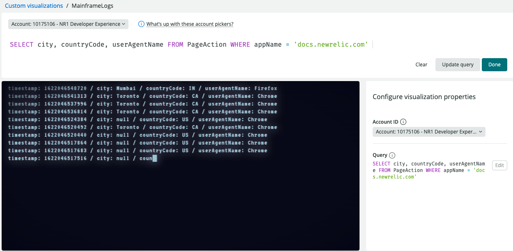
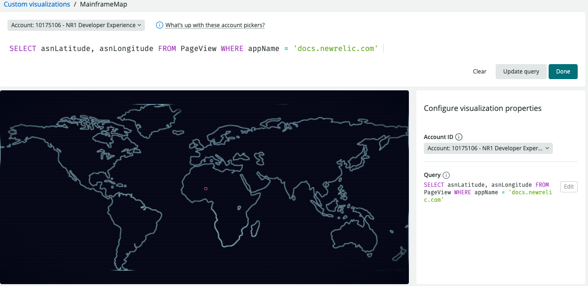
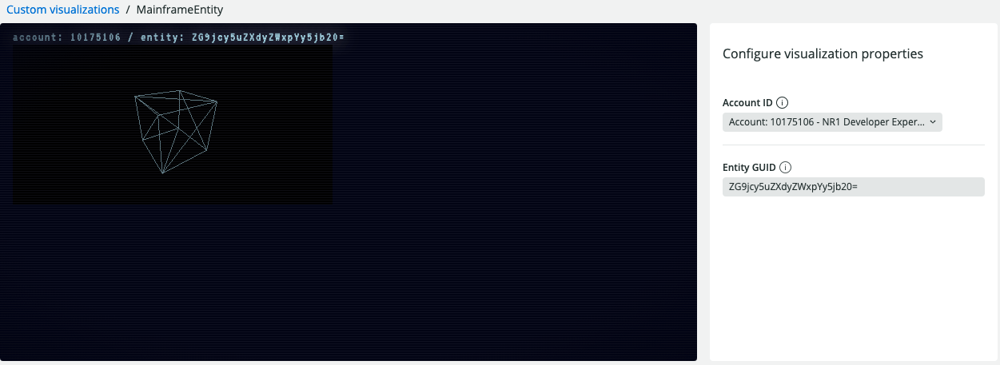

# Mainframe

Sometimes, in order to monitor your data, you need to _h4x into the mainframe_.

This is a _Proof of Concept_ for visualizations to make your dashboards look like hacker movies.

# Visualizations

## Mainframe: Logs
Display tabular data in a retro terminal. Results will "type" out on the screen.


## Mainframe: Map
Display lat / long information on a map. Currently, the positioning is not working.


## Mainframe: Entity
Display an entity and it's realtionships as 3d models, because that's usefull...


## Getting started

Run the following scripts:

```
npm install
npm start
```

Visit https://one.newrelic.com/?nerdpacks=local and :sparkles:

## Creating new artifacts

If you want to create new artifacts run the following command:

```
nr1 create
```

> Example: `nr1 create --type nerdlet --name my-nerdlet`.
